# M4Depth

This is the reference TensorFlow implementation for training and testing M4Depth, the depth estimation method described in

> **M4Depth: Monocular depth estimation for autonomous vehicles in unseen environments**
>
> [Michaël Fonder](https://www.uliege.be/cms/c_9054334/fr/repertoire?uid=u225873), [Damien Ernst](https://www.uliege.be/cms/c_9054334/fr/repertoire?uid=u030242) and [Marc Van Droogenbroeck](https://www.uliege.be/cms/c_9054334/fr/repertoire?uid=u182591) 
> 
> [arXiv pdf](https://arxiv.org/pdf/2105.09847.pdf)

## Overview

M4Depth is deep neural network designed to estimate depth from RGB image sequences acquired in unknown environments by a camera moving with 6 degrees of freedom (DoF), and is:

*  **Lightweight**: M4Depth only requires 500MB of VRAM to run;
*  **Real-time**: M4Depth has a fast inference time that makes it compatible for real-time applications on most GPUs;
*  **State-of-the-art**: M4Depth is state of the art on the Mid-Air dataset and outperforms existing methods in a generalization setup on the TartanAir dataset, while having good performances on the
KITTI dataset.

This network is the result of two major contributions: 
* We extend the notion of visual disparity to camera baselines featuring 6-DoF transformations, and present customized cost volumes for this disparity;
* We use these new cost volumes to build a novel real time and lightweight multi-level architecture;

This repository contains all the material necessary to reproduce the results presented in the paper.

<p align="center">
  <tr>
    <td> 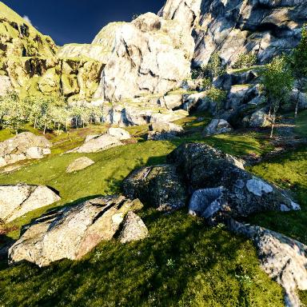</td>
    <td> 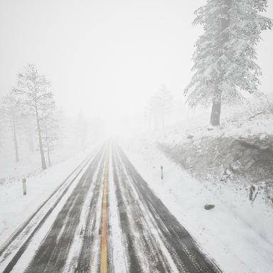</td>
    <td> 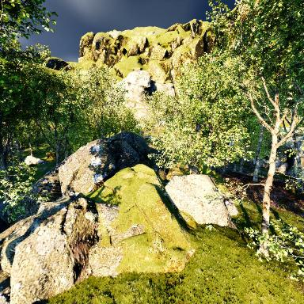</td>
    <td> 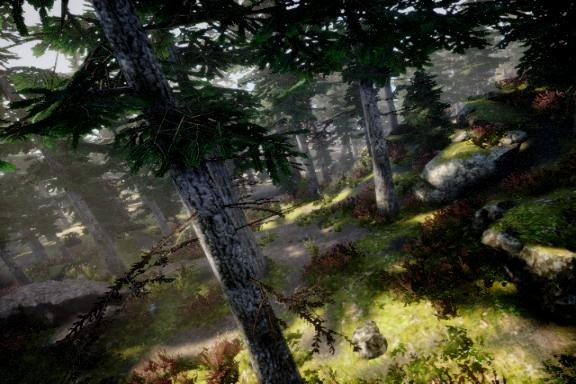</td>
    <td> 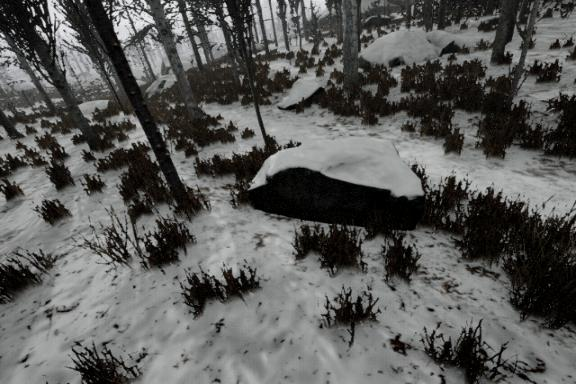</td>
   </tr> 
  <br>
  <tr>
    <td> 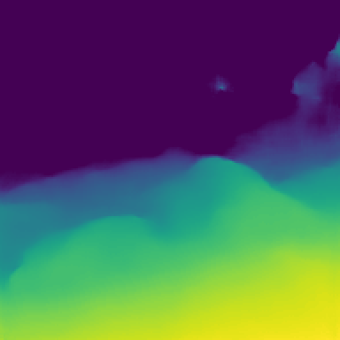</td>
    <td> 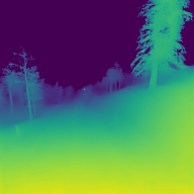</td>
    <td> 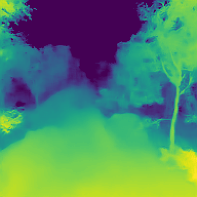</td>
    <td> 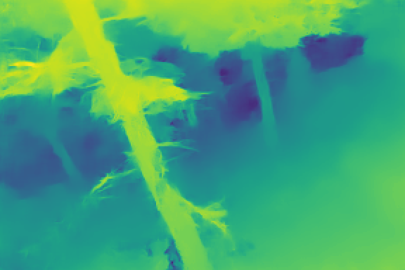</td>
    <td> 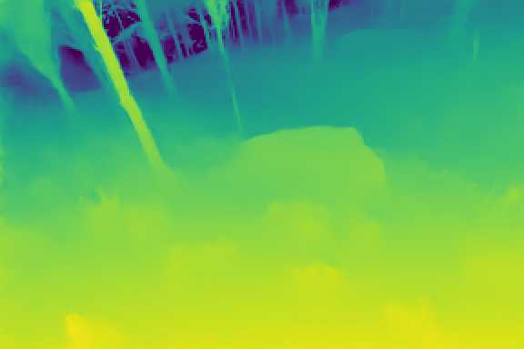</td>
   </tr>
  <br>
  <tr>
    <td> 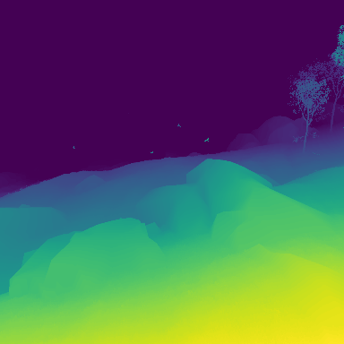</td>
    <td> 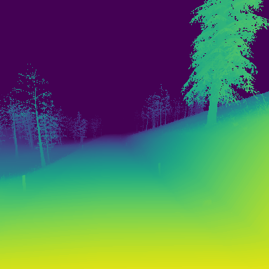</td>
    <td> 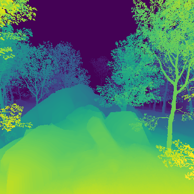</td>
    <td> 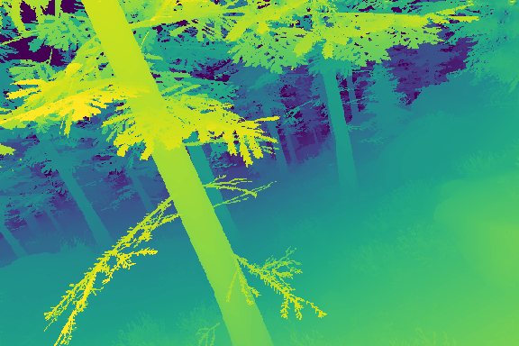</td>
    <td> 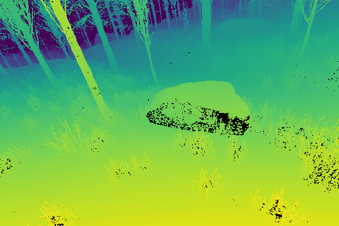</td>
   </tr>
  <br>
</p>
  Samples produced by our method trained on Mid-Air when tested on Mid-Air (three leftmost columns) and when tested in generalization on TartanAir (two rightmost columns): the first line shows the RGB picture capured by the camera, the second the results produced by our method and the last one the ground-truth depth map.
  
<hr>

## Citation

If you use our work in your research, please consider citing our paper:

```
@article{Fonder2021M4Depth,
  title     = {M4Depth: Monocular depth estimation for autonomous vehicles in unseen environments},
  author    = {Fonder, Michael and Ernst, Damien and Van Droogenbroeck, Marc},
  booktitle = {arXiv},
  month     = {May},
  year      = {2021}
}
```

## Dependencies

Assuming a fresh [Anaconda](https://www.anaconda.com/download/) distribution install, you can install the dependencies required to run our code with:
```shell
conda install -c conda-forge tensorflow-gpu=2.7 numpy pandas
```

To follow the instructions given in the rest of this ReadMe, you also have to extract the content of the zip archives:
```shell
unzip '*.zip'
```

### Datasets

Our set of experiments relies on three different datasets. Our code refers to the [`dataset_location.json`](dataset_location.json) configuration file to know where the data are located.

We provide scripts to download the datasets easily in the [`scripts`](scripts) directory, and detail how to use them hereunder. Please store each dataset in a disctinct directory to prevent issues with the scripts.

If you use our scripts to download the datasets, you won't have to edit the [`dataset_location.json`](dataset_location.json) configuration file. If you already have some datasets on your computer, you can edit the json file instead of downloading them. We provide information on how to do this hereunder.

#### Mid-Air [[1](#ref_1)]

To be able to download the Mid-Air dataset, you will need to get a file listing all the archives to download. For this, the procedure to follow is:
> 1. Go on the [download page of the Mid-Air dataset](https://midair.ulg.ac.be/download.html)
> 2. Select the "Left RGB" and "Stereo Disparity" image types
> 3. Move to the end of the page and enter your email to get the download links (the volume of selected data should be equal to 316.5Go)

When you have the file, execute our script to download and extract the dataset:
```shell
bash  scripts/0a-get_midair.sh path/to/desired/dataset/location path/to/download_config.txt
```

#### KITTI [[2](#ref_1)]

To automatically download and extract the KITTI dataset, you can simply run the following command:
```shell
bash  scripts/0b-get_kitti.sh path/to/desired/dataset/location
```

#### Tartanair [[3](#ref_1)]

To automatically download and extract the scenes from the TartanAir dataset used in our paper (gascola, season forest winter, neighborhood and old town), you can simply run the following command:
```shell
bash  scripts/0c-get_tartanair.sh path/to/desired/dataset/location
```

#### Editing [`dataset_location.json`](dataset_location.json) (facultative)

The [`dataset_location.json`](dataset_location.json) configuration file simply provides key-value pairs where:
*    the key is the name of one of the available datasets listed in the [`dataloaders/__init__.py`](dataloaders/__init__.py) file, and
*    the value stores a string that is the path pointing to the root directory of the data location for the corresponding dataset. This path can be relative or absolute. 

If you use our script to download the datasets, you don't have to edit it. However, if you already have some datasets on your computer, you can edit the paths in the json file instead of downloading them again with our scripts.

## Reproducing paper results

In the following subsections, we present script tha allow you to reproduce theexperiments as presented in the paper. These scripts assume that you downloaded the datasets as explained hereabove.

To benefit from the best code speed, you should compile the cuda implementation of the backprojection if you use a compatible GPU:    
```shell
cd cuda_backproject
bash make.sh
cd ..
```    

### Training from scratch

To perform a training with the same setup as the one presented in our paper, you can use the following scripts and monitor the training with tensorboard. A cuda compatible GPU with at least 12GB of VRAM is required to train the network with the same parameters than in the paper.
* Train on Mid-Air
```shell
bash  scripts/1a-train-midair.sh path/to/desired/weights/location
```

* Finetune on KITTI:
```shell
bash  scripts/1b-finetune-kitti.sh path/to/desired/weights/location
```

Please note that the training can sometimes crash because of the apparition of NaNs in the weights of the network. If this happens, the training has to be manually resumed from the latest checkpoint.

### Evaluation and Pretrained weights

You can compute the performance metrics of a trained version of M4Depth by using the following command line:
```shell
bash  scripts/2-evaluate.sh dataset path/to/weights/location
```
where the argument `dataset` can take the 4 following value: `midair`, `kitti`, `tartanair-gascola`, `tartanair-winter`, `tartanair-neighborhood` or `tartanair-oldtown` and where the second argument can be left blank.

If the second argument is not given, the evaluation will be done on the pretrained weights we provide. The resulting performance metrics should be the same as the ones reported in our paper.

### Other operations

Command line given hereabove are simply preparametrizations of the parameters that can be given to the `main.py`python script. Instead of using our bash scripts, you can directly call the python script and set the parameters as you want.

To see all the possible parameters and their use, you can request the python help:
```shell
python main.py --help
``` 

### Processing outputs

You can visualize, save or postprocess the outputs of the network easily by implementing the code you want in the `predict` case of the `main.py` file.

## Running on your own images

There is currently no easy one-line command that allows you to test M4Depth directly on your own data. If you want to test M4Depth on a custom dataset you need:

1. Generate the csv files mapping the frame location and frame-to-frame camera motion. The script `scripts/midair-split-generator.py` is the one we used to generate the csv files for Mid-Air in `data/midair`. You can adapt it for your own data. 
2. Write the corresponding dataloader (it should inherit from the `DataLoaderGeneric` class, see `dataloaders` directory).
3. Add your dataset as a possible choice in the options for the `--dataset` command line argument.

Once this is done, you should be able to use your dataset with the `main.py` python script.

## References

If you use one of the datasets in your research, please consider citing the related paper:

<a name="ref_1"></a>

```
[1]
@inproceedings{Fonder2019MidAir,
  author    = {Fonder, Michael and Van Droogenbroeck, Marc},
  title     = {Mid-Air: A multi-modal dataset for extremely low altitude drone flights},
  booktitle = {IEEE International Conference on Computer Vision and Pattern Recognition Workshops (CVPRW)},
  year      = {2019},
  month     = {June}
}

[2]
@inproceedings{Geiger2012AreWe,
  title = {Are we ready for Autonomous Driving? {T}he {KITTI} Vision Benchmark Suite},
  author = {Geiger, Andreas and Lenz, Philip and Urtasun, Raquel},
  booktitle = {IEEE International Conference on Computer Vision (CVPR)},
  pages = {3354-3361},
  month = Jun,
  year = {2012}
}

[3]
@inproceedings{Wang2020TartanAir,
  title = {{TartanAir}: A Dataset to Push the Limits of Visual {SLAM}},
  author = {Wang, Wenshan and Zhu, Delong and Wang, Xiangwei and Hu, Yaoyu and Qiu, Yuheng and Wang, Chen and Hu, Yafei and Kapoor, Ashish and Scherer, Sebastian},
  booktitle = {IEEE/RSJ International Conference on Intelligent Robots and Systems (IROS)},
  pages = {4909-4916},
  month = {October},
  year = {2020}
}
```

## License

Our code is licensed under the AGPLv3 - See the [LICENSE](LICENSE) file for details.

The cuda implementation of the backprojection is not ours and is licensed under BSD 3 Clause License (see the corresponding [LICENSE](cuda_backproject/LICENSE) )
