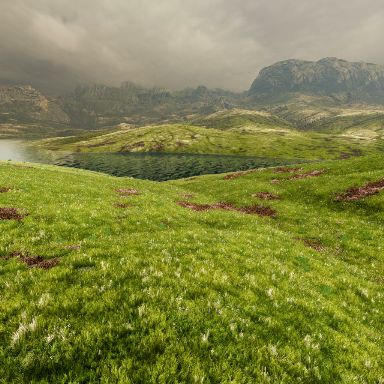
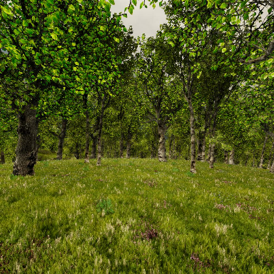
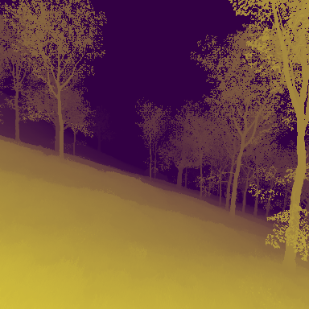
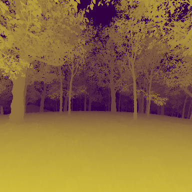
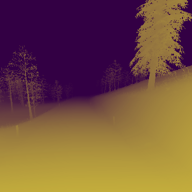
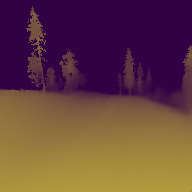

# M4Depth


This is the reference TensorFlow implementation for training and testing depth estimation models using the method described in

> **M4Depth: A motion-based approach for monocular depth estimation on video sequences**
>
> [Michaël Fonder](https://www.uliege.be/cms/c_9054334/fr/repertoire?uid=u225873), [Damien Ernst](https://www.uliege.be/cms/c_9054334/fr/repertoire?uid=u030242) and [Marc Van Droogenbroeck](https://www.uliege.be/cms/c_9054334/fr/repertoire?uid=u182591) 
> 
> [arXiv pdf](https://arxiv.org/)

<p align="center">
  <tr>
    <td> </td>
    <td> </td>
    <td> </td>
    <td> </td>
    <td> </td>
    <td> </td>
   </tr> 
  <br>
  <tr>
    <td> </td>
    <td> </td>
    <td> </td>
    <td> </td>
    <td> </td>
    <td> </td>
   </tr>
  <br>
  <tr>
    <td> </td>
    <td> </td>
    <td> </td>
    <td> </td>
    <td> </td>
    <td> </td>
   </tr>
  <br>
</p>

If you find our work useful in your research please consider citing our paper:

```
@article{Fonder2021M4Depth,
  title     = {M4Depth: A motion-based approach for monocular depth estimation on video sequences},
  author    = {Michael Fonder and Damien Ernst and Marc Van Droogenbroeck},
  booktitle = {arXiv},
  month = {May},
year = {2021}
}
```

## Dependencies

Assuming a fresh [Anaconda](https://www.anaconda.com/download/) distribution, you can install the dependencies with:
```shell
conda install tensorflow-gpu=1.15 h5py pyquaternion numpy 
```

## Formatting data

Our code works with tensorflow protobuffer files data for training and testing therefore need to be encoded properly before being passed to the network.

### Mid-Air dataset

To reproduce the results of our paper, you can use the Mid-Air dataset for training and testing our network. For this, you will first need to download the required data on your computer. The procedure to get them is the following:
> 1. Go on the [download page of the Mid-Air dataset](https://midair.ulg.ac.be/download.html)
> 2. Select the "Left RGB" and "Stereo Disparity" image types
> 3. Move to the end of the page and enter your email to get the download links (the volume of selected data should be equal to 316.5Go)
> 4. Follow the procedure given at the begining of the download page to download and extract the dataset

Once the dataset is downloaded you can generate the required protobuffer files by running the following script:
```shell
python3 midair-protobuf_generation.py --db_path path/to/midair-root --output_dir desired/protobuf-location --write
```
This script generates trajectory sequences with a length of 8 frames and automatically creates the train and test splits for Mid-Air in separated subdirectories.

### Custom data

You can also train or test our newtork on your own data. You can generate your own protobuffer files by repurpusing our *midair-protobuf_generation.py* script. When creating your own protobuffer files, you should pay attention to two major parameters; All sequences should have the same length and each element of a sequence should come with the following data:
* "image/color_*i*" : the binary data of the jpeg picture encoding the color data of the frame
* "Image/depth_*i*" : the binary data of the 16-bit png file encoding the stereodisparity map
* "data/omega_*i*" : a lis of three float32 numbers corresponding to the angular rotation between two consecutive frames
* "data/trans_*i*" : a lis of three float32 numbers corresponding to the translation between two consecutive frames

The subscript *i* has to be replaced by the index of the data within the trajectory. Translations and rotations are expressed in the standard camera frame of refence axis system.

## Training

You can launch a training or a finetuning (if the log_dir already exists) by exectuting the following command line:
```shell
python3 m4depth_pipeline.py --train_datadir=path/to/protobuf/dir --log_dir=path/to/logdir --dataset=midair --arch_depth=6 --db_seq_len=8 --seq_len=6 --num_batches=200000 -b=3 -g=1 --summary_interval_secs=900 --save_interval_secs=1800
```
If needed, other options are available for the training phase and are described in *pipeline_options.py* and in *m4depth_options.py* files. Please note that the code can run on multiple GPUs to speedup the training.

## Testing/Evaluation

You can launch the evaluation of your test samples by exectuting the following command line:
```shell
python3 m4depth_pipeline.py --test_datadir=path/to/protobuf/dir --log_dir=path/to/logdir --dataset=midair --arch_depth=6 --db_seq_len=8 --seq_len=8 --b=3 -g=1
```
If needed, other options are available for the evaluation phase and are described in *pipeline_options.py* and in *m4depth_options.py* files.

### Pretrained model

We provide pretrained weights for our model in the "trained_weights" directory. Testing or evaluating a dataset from these weight can be done by executing the following command line:
```shell
python3 m4depth_pipeline.py --test_datadir=path/to/protobuf/dir --log_dir=trained_weights/M4Depth-d6 --dataset=midair --arch_depth=6 --db_seq_len=8 --seq_len=8 --b=3 -g=1
```

